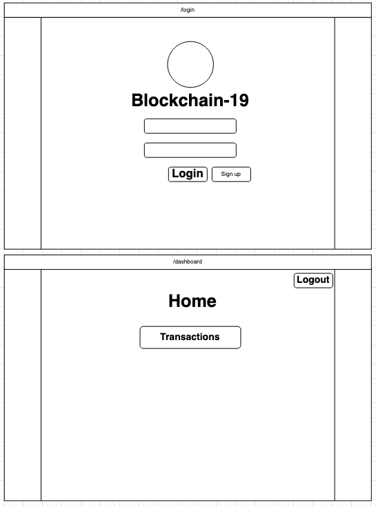
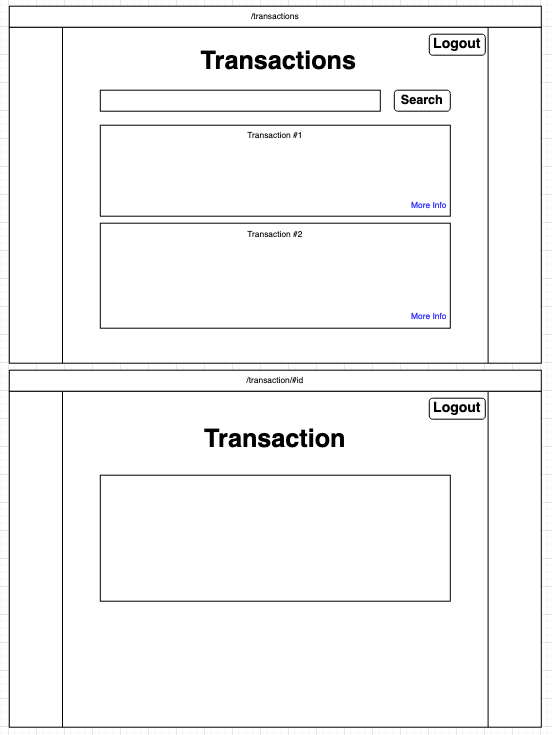
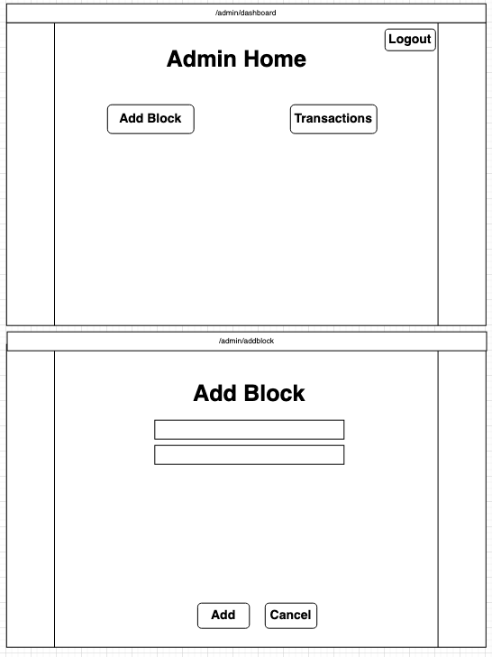
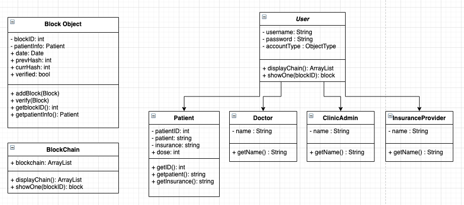

# Blockchain19
[](https://travis-ci.com/charliekid/Blockchain19)

This project is implement a blockchain system that will decentralize and help track the integrity and process of the COVID19 vaccine.

## Project Board
https://github.com/charliekid/Blockchain19/projects/1

## Project Mission / Motiviation

There is limited visibility within the medical supply chain when it comes to receiving medications or vaccinations. From manufacturers, logistics, hospitals/clinics, and recipients there is a lack of transparency with the process that causes errors, waste of resources (money and time), and are more susceptible to data breaches.

## Project Objective
We will work with Jonathan and Matt from the DMDC to make a program that will track and verify the status and process of a COVID-19 vaccination in a decentralized manner utilizing some form of Blockchain by the end of this semester.

## Project Approach
- We would need to do research on the process of a COVID-19 vaccination from start to finish. Then decide on which portion of that supply chain we wish to implement the blockchain technology to.
- Afterwards we will apply the agile development and create user stories. This will help divide up the work of the project.
- For this project we will be using Java. Our team is most familiar with Java. Since blockchain is a new concept for all of us, we decided to choose a language that we would not struggle with.
- We will also be using Google cloud platform. Using a platform is common in the industry and we wanted to apply this to our project.

## Dependencies / Risks
- Dependencies:
  - The usage of SHA-256, RSA encryption scheme
  - Understanding the blockchain model.
  - Learning and refreshing on java and the Google cloud platform we would be using.
- Risk:
  - Blockchain not working as expected, or potentially less efficient than existing databases and tracking methods.

## Project Deliverables
- Blockchain-powered tracker for supply chain management
- A document comparing the performance of blockchain compared to other databases


## User Stories
https://bit.ly/3dP3OBZ


## Mockups




## UMLs and ERDs



<p align="center">
  
</p>

# CorDapp - Java [](https://ide.corda.net/?folder=/home/coder/cordapp-template-java)


This application is a CorDapp. We used a template from Corda that was stubbed-out so that we can create our own project over it.

# Pre-Requisites

See https://docs.corda.net/getting-set-up.html.

# Usage

## Running tests inside IntelliJ

We recommend editing your IntelliJ preferences so that you use the Gradle runner - this means that the quasar utils
plugin will make sure that some flags (like ``-javaagent`` - see below) are
set for you.

To switch to using the Gradle runner:

* Navigate to ``Build, Execution, Deployment -> Build Tools -> Gradle -> Runner`` (or search for `runner`)
  * Windows: this is in "Settings"
  * MacOS: this is in "Preferences"
* Set "Delegate IDE build/run actions to gradle" to true
* Set "Run test using:" to "Gradle Test Runner"

If you would prefer to use the built in IntelliJ JUnit test runner, you can run ``gradlew installQuasar`` which will
copy your quasar JAR file to the lib directory. You will then need to specify ``-javaagent:lib/quasar.jar``
and set the run directory to the project root directory for each test.

## Running the nodes

See https://docs.corda.net/tutorial-cordapp.html#running-the-example-cordapp.

## Interacting with the nodes

### Shell

When started via the command line, each node will display an interactive shell:

    Welcome to the Corda interactive shell.
    Useful commands include 'help' to see what is available, and 'bye' to shut down the node.

    Tue Nov 06 11:58:13 GMT 2018>>>

You can use this shell to interact with your node. For example, enter `run networkMapSnapshot` to see a list of
the other nodes on the network:

    Tue Nov 06 11:58:13 GMT 2018>>> run networkMapSnapshot
    [
      {
      "addresses" : [ "localhost:10002" ],
      "legalIdentitiesAndCerts" : [ "O=Notary, L=London, C=GB" ],
      "platformVersion" : 3,
      "serial" : 1541505484825
    },
      {
      "addresses" : [ "localhost:10005" ],
      "legalIdentitiesAndCerts" : [ "O=PartyA, L=London, C=GB" ],
      "platformVersion" : 3,
      "serial" : 1541505382560
    },
      {
      "addresses" : [ "localhost:10008" ],
      "legalIdentitiesAndCerts" : [ "O=PartyB, L=New York, C=US" ],
      "platformVersion" : 3,
      "serial" : 1541505384742
    }
    ]

    Tue Nov 06 12:30:11 GMT 2018>>>

You can find out more about the node shell [here](https://docs.corda.net/shell.html).

### Client

`clients/src/main/java/com/template/Client.java` defines a simple command-line client that connects to a node via RPC
and prints a list of the other nodes on the network.

#### Running the client

##### Via the command line

Run the `runTemplateClient` Gradle task. By default, it connects to the node with RPC address `localhost:10006` with
the username `user1` and the password `test`.

##### Via IntelliJ

Run the `Run Template Client` run configuration. By default, it connects to the node with RPC address `localhost:10006`
with the username `user1` and the password `test`.

### Webserver

`clients/src/main/java/com/template/webserver/` defines a simple Spring webserver that connects to a node via RPC and
allows you to interact with the node over HTTP.

The API endpoints are defined here:

     clients/src/main/java/com/template/webserver/Controller.java

And a static webpage is defined here:

     clients/src/main/resources/static/

#### Running the webserver

##### Via the command line

Run the `runTemplateServer` Gradle task. By default, it connects to the node with RPC address `localhost:10006` with
the username `user1` and the password `test`, and serves the webserver on port `localhost:10050`.

##### Via IntelliJ

Run the `Run Template Server` run configuration. By default, it connects to the node with RPC address `localhost:10006`
with the username `user1` and the password `test`, and serves the webserver on port `localhost:10050`.

#### Interacting with the webserver

The static webpage is served on:

    http://localhost:10050

While the sole template endpoint is served on:

    http://localhost:10050/templateendpoint

# Extending the template

You should extend this template as follows:

* Add your own state and contract definitions under `contracts/src/main/java/`
* Add your own flow definitions under `workflows/src/main/java/`
* Extend or replace the client and webserver under `clients/src/main/java/`

For a guided example of how to extend this template, see the Hello, World! tutorial
[here](https://docs.corda.net/hello-world-introduction.html).


## Running our CorDapp

Normally, you'd interact with a CorDapp via a client or webserver. So we can
focus on our CorDapp, we'll be running it via the node shell instead.

Once you've finished the CorDapp's code, run it with the following steps:

* Build a test network of nodes by opening a terminal window at the root of
  your project and running the following command:

  * Windows:   `gradlew.bat deployNodes`
  * macOS:     `./gradlew deployNodes`

* Start the nodes by running the following command:

  * Windows:   `build\nodes\runnodes.bat`
  * macOS:     `build/nodes/runnodes`

* Once the nodes have been deployed and are running, go to the terminal of Patient1 (not the notary!)
  and run the following command to send information to Doctor1:
  
```
flow start PatientSendInfoInitiator firstName: "Charlie", lastName: "Nguyen", dose: "0", approvedForVaccination: "false", firstDoseDate: "0000-00-00", firstDoseLot: "none", firstDoseManufacturer: "none", secondDoseDate: "0000-00-00", secondDoseLot: "none", secondDoseManufacturer: "none", vaccinationProcessComplete: "false", patientFullName: Patient1, doctor: Doctor1, patientEmployer: Employer1, clinicAdmin: clinicAdmin1
```

* The following command will then be run on the Doctor1 Node:
```
flow start ApprovePatientInitiator firstName: "Charlie", lastName: "Nguyen", dose: "0", approvedForVaccination: "true", firstDoseDate: "0000-00-00", firstDoseLot: "none", firstDoseManufacturer: "none", secondDoseDate: "0000-00-00", secondDoseLot: "none", secondDoseManufacturer: "none", vaccinationProcessComplete: "false", patientFullName: Patient1, doctor: Doctor1, patientEmployer: Employer1, clinicAdmin: clinicAdmin1
```
* Afterwards, the ClinicAdmin1 Node can run those three commands:
```
flow start AdministerFirstDoseInitiator firstName: "Charlie", lastName: "Nguyen", dose: "1", approvedForVaccination: "true", firstDoseDate: "2021-03-03", firstDoseLot: "123a45b", firstDoseManufacturer: "pfizer", secondDoseDate: "0000-00-00", secondDoseLot: "none", secondDoseManufacturer: "none", vaccinationProcessComplete: "false", patientFullName: Patient1, doctor: Doctor1, patientEmployer: Employer1, clinicAdmin: clinicAdmin1

flow start AdministerSecondDoseInitiator firstName: "Charlie", lastName: "Nguyen", dose: "2", approvedForVaccination: "true", firstDoseDate: "2021-03-03", firstDoseLot: "123a45b", firstDoseManufacturer: "pfizer", secondDoseDate: "2021-03-24", secondDoseLot: "678c90d", secondDoseManufacturer: "pfizer", vaccinationProcessComplete: "false", patientFullName: Patient1, doctor: Doctor1, patientEmployer: Employer1, clinicAdmin: clinicAdmin1

flow start ApprovePatientForWorkInitiator firstName: "Charlie", lastName: "Nguyen", dose: "2", approvedForVaccination: "true", firstDoseDate: "2021-03-03", firstDoseLot: "123a45b", firstDoseManufacturer: "pfizer", secondDoseDate: "2021-03-24", secondDoseLot: "678c90d", secondDoseManufacturer: "pfizer", vaccinationProcessComplete: "true", patientFullName: Patient1, doctor: Doctor1, patientEmployer: Employer1, clinicAdmin: clinicAdmin1
```

The Employer1 Node acts as an observer for those transactions, not actually facilitating any transactions.


* You can now see the tokens in the vaults of Patient1, Doctor1, Employer1, and ClinicAdmin1 nodes.
  by running the following command in their respective terminals:

  `run vaultQuery contractStateType: com.template.states.PatientInfoState`
  

* You must run both the "runTemplateServer" (ran in the root of project) and "npx nodemon" (ran in root of resources within clients folder)
